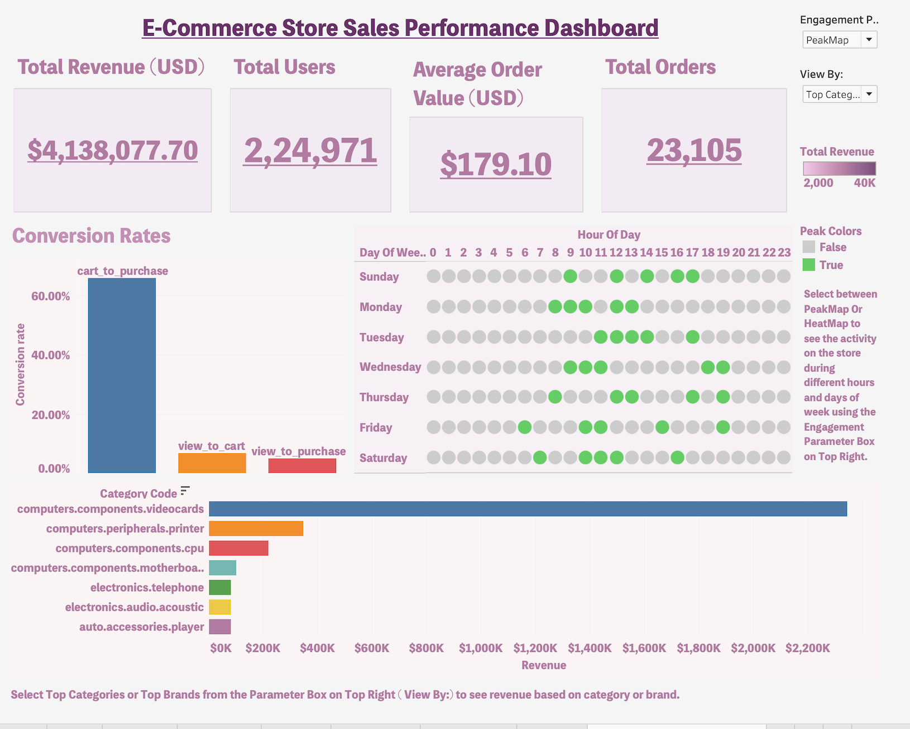
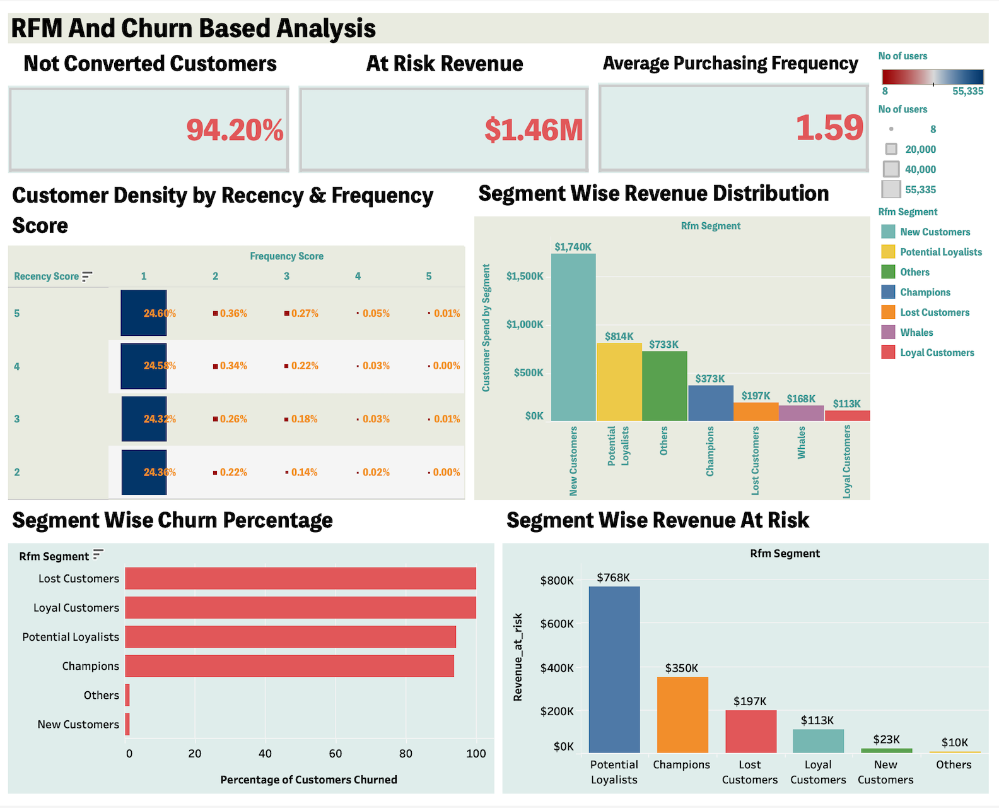

# E-Commerce Store Analysis 

## Overview
This project focuses on analyzing customer behavior and sales performance using the REES46 Electronics E-Commerce Event History dataset. The objective is to extract actionable insights that can drive strategic decisions for improving revenue, customer retention, and marketing effectiveness.

**Using tools like SQL and Tableau, the project covers three core areas:**

* Sales Performance & Revenue Analysis

* Customer Segmentation (RFM Analysis)

* Customer Churn Prediction

### Key Analysis

#### 1. **Sales & Revenue**
- Analyzed total revenue, average order value, and top-selling products.
- Saw the **conversion rates** from various steps of ordering.

#### 2. **Customer Segmentation (RFM)**
- Used **RFM analysis** to segment customers by engagement and value.
- Around 50% of the customers were new and recent, showing strong customer acquisition.

#### 3. **Churn Prediction**
- Identified at-risk customers based on recency and activity trends.
- Suggested re-engagement strategies for inactive users.

### Key Business Questions

This project aimed to answer the following business-critical questions:

1. **What is the overall sales performance and revenue trend?**
2. **Which products and categories drive the most revenue?**
3. **Where are users dropping off in the sales funnel?**
4. **How can we segment customers based on their behavior and value?**
5. **What proportion of customers are new, loyal, or at risk?**
6. **Which users are likely to churn, and how can we re-engage them?**

###  Tools Used

- **SQL**: For data cleaning, transformation, and querying key metrics from raw event data.
- **Tableau**: To build interactive dashboards for sales performance, customer segmentation, and churn analysis.
- **MS Excel**: 
Used to retrieve Data from the source for loading into the computer,
storing final processed datasets for efficient analysis.

### Data Preparation & Cleanup

- Filtered relevant events such as `view`, `add to cart`, and `purchase` from raw event logs.
```sql
-- Getting the Conversion Rate
-- View Events
SELECT COUNT(*) AS view_events
FROM ecommerce_events
WHERE event_type = 'view';

-- Cart Events
SELECT COUNT(*) AS cart_events
FROM ecommerce_events
WHERE event_type = 'cart';

-- Purchase Events
SELECT COUNT(*) AS purchase_events
FROM ecommerce_events
WHERE event_type = 'purchase';

WITH funnel AS
(SELECT
    COUNT(CASE WHEN event_type = 'view' THEN 1 END) AS views,
    COUNT(CASE WHEN event_type = 'cart' THEN 1 END) AS cart_adds,
    COUNT(CASE WHEN event_type = 'purchase' THEN 1 END) AS purchases
FROM ecommerce_events)

SELECT *,
      ROUND(100 * cart_adds / views , 2) AS view_to_cart,
      ROUND(100 * purchases / cart_adds , 2) AS cart_to_purchase,
      ROUND(100 * purchases / views , 2) AS view_to_purchase
      FROM funnel;

-- Therefore computed the percentage conversion from one event to the other.
```
- Removed duplicate and incomplete records to ensure data accuracy.
- Parsed timestamps and converted them into a consistent datetime format for analysis.
- Merged event data with product and user information for a complete view of customer activity.
- Created additional columns such as order count, total spend, and last activity date to support RFM and churn analysis.
- Exported cleaned data for use in SQL queries and Tableau visualizations.

**Have a look at the full cleaning process in the main .sql files**

## The Analysis
### 1.  Sales Analysis Process

This analysis aimed to understand sales performance and user engagement using transactional and behavioral data. The key steps were:

#### Simple View of Sales Analysis Dashboard:

**To view the full dashboard with functionalities**:
[Click Here](https://public.tableau.com/views/EcommerceStoreSalesPerformanceDashboard/SalesPerformanceDashboardElectronicsE-Commerce?:language=en-GB&:sid=&:redirect=auth&:display_count=n&:origin=viz_share_link)


1. **Revenue & Order Metrics**
   - Calculated **Total Revenue** (~$4.13M), **Total Orders** (23,105), and **Average Order Value** (~$179.10).
   - Tracked **Total Users** (2,24,971) involved in interactions and purchases.

2. **Conversion Rates**
   - Measured conversion rates at each stage:
     - **Cart to Purchase**: Highest conversion (~65%)
     - **View to Cart** and **View to Purchase**: Significantly lower, highlighting major drop-offs.
   - Helped identify where users abandon the buying journey.

3. **Category-Level Revenue**
   - Visualized revenue contributions from top-performing product categories.
   - Highest revenue came from `computers.components.videocards` followed by `printer` and `cpu` components.

4. **User Engagement Pattern**
   - Created a **Heat Map / Peak Map** to analyze peak engagement times by **hour of day** and **day of week**.
   - Found higher activity during midday to evening hours, especially on weekdays.

5. **Interactive Filtering**
   - Enabled parameter-based filtering (top categories or brands) to explore revenue contributions dynamically.
   - Allowed quick toggling between engagement heatmap and peak hours view.

This sales analysis provided a comprehensive understanding of user behavior, top revenue drivers, and the effectiveness of the purchase funnel, enabling data-backed optimizations.

### 2. Customer Segmentation (RFM Analysis)


This analysis focused on segmenting customers based on their purchasing behavior using the **RFM (Recency, Frequency, Monetary)** model.

1. **Metric Calculation**
   - **Recency**: Days since last purchase for each user.
   - **Frequency**: Total number of purchases made by each user.
   - **Monetary**: Total spend per user across all transactions.

2. **RFM Scoring**
   - Assigned scores from 1 to 5 to each RFM metric (higher = better).
   - Combined RFM scores to rank customers based on engagement and value.

3. **Customer Segments Created**
   - Grouped users into meaningful segments such as:
     - **Champions**
     - **Loyal Customers**
     - **Potential Loyalists**
     - **New Customers**
     - **Lost Customers**
     - **Others**

4. **Key Findings**
   - ~98% of users were from **new or other** categories, indicating strong acquisition performance.
   - Segments like **Loyal Customers** and **Champions** had **very few users**, highlighting weak long-term retention.
   - Indicates a need for better **customer retention strategies** to convert new users into repeat buyers.

5. **Visualization**
   - Built interactive Tableau dashboard to explore:
     - RFM score distribution
     - Revenue by segment
     - Engagement levels across customer types

This segmentation revealed critical insights into customer lifecycle stages and provided direction for improving user retention and loyalty.

### 3. Churn Analysis

Churn analysis was performed to identify customers who are no longer engaging with the platform and understand the factors contributing to customer drop-off.

1. **Churn Definition**
   - A user was considered **churned** if they had no activity (view, cart, or purchase) in a defined recent period compared to their last active date.
   - Users with low recency scores in the RFM model were flagged as at-risk or churned.

2. **Segmentation of Churned Users**
   - Identified **churned**, **at-risk**, and **inactive** users using recency thresholds.
   - Churn threshold was dynamically defined for all users and ensured no rigid threshold for churn be made since different users have different buying preferences, categories, income etc.

3. **Key Insights**
   - A significant portion of customers had only one purchase, suggesting high early churn.
   - Many users dropped off after initial engagement stages (view or cart), never reaching the purchase phase.
   - **Very few users made repeat purchases**, confirming gaps in post-purchase engagement.

4. **Visualization**
   - Created churn-focused views in Tableau showing:
     - Churned user counts by segment
     - Revenue at Risk due to inactive customers
     - 94.20% customers never made purchase showing low conversion rate for first time visiters.

5. **Business Implication**
   - Highlights the need for **retargeting**, **email campaigns**, and **loyalty programs** to re-engage first-time or inactive buyers.
   - Suggests implementing **personalized follow-ups** based on user behavior to reduce churn rate.
   - The 94.20% non-conversion rate indicates significant room for improvement in the user journey particularly in streamlining the buying process, enhancing promotional strategies, and boosting competitive positioning.

**This churn analysis helped uncover why customers leave and how to proactively retain them with targeted interventions.**

Static View of the dashboard:


**To view the full dashboard with functionalities**:
[Click Here](https://public.tableau.com/views/CustomerSegmentationAndChurnAnalysisRFMModel/Dashboard1?:language=en-GB&:sid=&:redirect=auth&:display_count=n&:origin=viz_share_link)

## Overall Summary

This e-commerce analytics project simulated a real-world business scenario where data-driven decisions are essential to improve performance and user engagement. As a Data Analyst, I utilized SQL for data extraction and transformation, and Tableau for interactive dashboarding to uncover actionable insights across sales, customer behavior, and conversion rates.

The analysis revealed strong acquisition numbers but significant challenges in conversion and retention. Insights such as a 94.20% non-conversion rate and minimal loyal customer base suggested clear areas for optimization in the customer journey, marketing, and post-purchase engagement.

---

### 📚 What I Learned (As a Data Analyst)

- **Data Preparation & Querying**: Cleaned and transformed raw event-level data using SQL for analysis-ready tables.
- **Business-Centric Analysis**: Framed and answered key business questions around sales trends, customer segments, and churn.
- **Customer Segmentation (RFM)**: Applied RFM logic to categorize users and assess engagement and value levels.
- **Conversion & Churn Insights**: Identified drop-off points and patterns in the user journey to guide strategy.
- **Interactive Dashboarding**: Designed a stakeholder-ready Tableau dashboard with KPIs, heatmaps, and filters.
- **Analytical Thinking**: Developed a data-backed narrative that connects user behavior to business performance and strategy.

This project reflects my core skills as a Data Analyst — turning raw data into insights that drive smarter, faster decisions.

## Limitations & Future Scope

While this project provided several actionable insights, there were a few limitations and areas where the analysis could be further enhanced:

1. **Product & Brand-Level Analysis**  
   - The analysis touched briefly on top-performing categories, but a deeper dive into **individual product performance** and **brand-wise trends** could provide more granular business insights.

2. **Churn Prediction Using Machine Learning**  
   - The churn analysis was rule-based using RFM logic. Incorporating **machine learning models** (e.g., logistic regression, decision trees) could help **predict churn probability** more accurately using behavioral features.

3. **Automation with AI**  
   - Many of the tasks such as segment tagging, funnel breakdown, and churn flagging were done manually. **AI-powered automation** could streamline these processes for larger, real-time datasets.

4. **Lack of Real-Time Data**  
   - The dataset was static and historical. Working with **live or streaming data** would allow dynamic dashboards and real-time business monitoring.

5. **Limited Use of Excel**  
   - Excel was minimally used for file formatting. Future versions could include **Excel-based dashboards or forecasting models** for business users less familiar with SQL/Tableau.

---
**These limitations can be rectified with future improvements in my knowledge and skills.**

## Conclusion

This project provided a clear understanding of user behavior, sales performance, and retention challenges in an e-commerce setting. Using SQL and Tableau, I translated raw data into actionable insights, highlighting both strengths and areas for improvement. It reinforced my ability to think analytically, build data-driven stories, and deliver business value as a Data Analyst.


